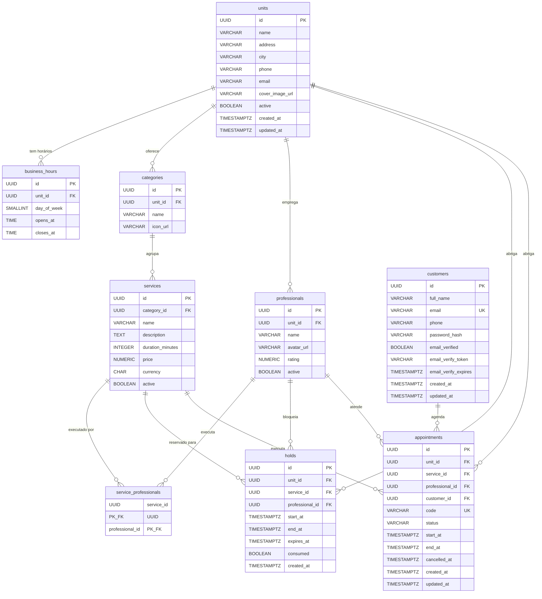

# Banco de Dados — SytTech Scheduler

Documento gerado a partir das migrations Flyway em
`src/main/resources/db/migration/V1..V5.sql`. **PostgreSQL 16+**.

> Convenções:
> - Todos os IDs são `UUID` (gerados na aplicação).
> - Todas as datas/horas são `TIMESTAMPTZ` (armazenado em UTC; a API recebe/devolve em ISO-8601 com offset).
> - Timezone padrão da aplicação: `America/Sao_Paulo`.
> - Schema único; o histórico do Flyway fica em `flyway_schema_history`.
> - A tabela `event_publication` é criada/gerenciada pelo **Spring Modulith** (não pelo Flyway).

---

## 1. Diagrama ER (Mermaid)



---

## 2. Tabelas

### 2.1 `units` — Unidades / salões
Origem: `V1__units.sql`.

| Coluna            | Tipo           | Restrições              | Descrição |
|-------------------|----------------|-------------------------|-----------|
| `id`              | UUID           | **PK**                  | Identificador da unidade. |
| `name`            | VARCHAR(160)   | NOT NULL                | Nome de exibição (ex.: "SytTech Centro"). |
| `address`         | VARCHAR(255)   |                         | Endereço completo. |
| `city`            | VARCHAR(120)   |                         | Cidade — usada como filtro na busca. |
| `phone`           | VARCHAR(40)    |                         | Telefone de contato. |
| `email`           | VARCHAR(160)   |                         | E-mail de contato. |
| `cover_image_url` | VARCHAR(500)   |                         | URL da imagem de capa. |
| `active`          | BOOLEAN        | NOT NULL DEFAULT TRUE   | Soft-flag para esconder a unidade sem deletar. |
| `created_at`      | TIMESTAMPTZ    | NOT NULL DEFAULT NOW()  | Auditoria — criação. |
| `updated_at`      | TIMESTAMPTZ    | NOT NULL DEFAULT NOW()  | Auditoria — última atualização. |

**Índices**:
- `idx_units_city` em `(city) WHERE active = TRUE` — acelera busca por cidade.

---

### 2.2 `business_hours` — Janela comercial semanal
Origem: `V1__units.sql`.

| Coluna        | Tipo        | Restrições                          | Descrição |
|---------------|-------------|-------------------------------------|-----------|
| `id`          | UUID        | **PK**                              | Identificador. |
| `unit_id`     | UUID        | FK → `units(id)` ON DELETE CASCADE  | Unidade dona da janela. |
| `day_of_week` | SMALLINT    | CHECK 1..7                          | 1 = segunda … 7 = domingo (ISO-8601). |
| `opens_at`    | TIME        | NOT NULL                            | Horário de abertura. |
| `closes_at`   | TIME        | NOT NULL, > `opens_at`              | Horário de fechamento. |

**Constraints**:
- `business_hours_window_valid`: `closes_at > opens_at`.
- `business_hours_unique`: `UNIQUE(unit_id, day_of_week)` — só uma janela por dia.

> Usada pelo `GetAvailabilityUseCase` para gerar slots.

---

### 2.3 `categories` — Categorias de serviços
Origem: `V2__catalog.sql`.

| Coluna     | Tipo          | Restrições                          | Descrição |
|------------|---------------|-------------------------------------|-----------|
| `id`       | UUID          | **PK**                              | Identificador. |
| `unit_id`  | UUID          | FK → `units(id)` ON DELETE CASCADE  | Unidade dona da categoria. |
| `name`     | VARCHAR(120)  | NOT NULL                            | Ex.: "Cabelo", "Barba", "Estética". |
| `icon_url` | VARCHAR(500)  |                                     | Ícone exibido na UI. |

**Constraints**:
- `categories_unit_name_unique`: `UNIQUE(unit_id, name)`.

---

### 2.4 `services` — Serviços oferecidos
Origem: `V2__catalog.sql`.

| Coluna             | Tipo            | Restrições                              | Descrição |
|--------------------|-----------------|-----------------------------------------|-----------|
| `id`               | UUID            | **PK**                                  | Identificador. |
| `category_id`      | UUID            | FK → `categories(id)` ON DELETE CASCADE | Categoria à qual pertence. |
| `name`             | VARCHAR(160)    | NOT NULL                                | Nome do serviço. |
| `description`      | TEXT            |                                         | Descrição longa. |
| `duration_minutes` | INTEGER         | CHECK > 0                               | Duração — usada para calcular `end_at`. |
| `price`            | NUMERIC(12,2)   | CHECK ≥ 0                               | Preço base. |
| `currency`         | CHAR(3)         | NOT NULL DEFAULT 'BRL'                  | ISO-4217 (BRL, USD, etc.). |
| `active`           | BOOLEAN         | NOT NULL DEFAULT TRUE                   | Permite "aposentar" um serviço. |

**Índices**:
- `idx_services_category` em `(category_id)`.

---

### 2.5 `professionals` — Profissionais
Origem: `V2__catalog.sql`.

| Coluna       | Tipo          | Restrições                          | Descrição |
|--------------|---------------|-------------------------------------|-----------|
| `id`         | UUID          | **PK**                              | Identificador. |
| `unit_id`    | UUID          | FK → `units(id)` ON DELETE CASCADE  | Unidade onde atende. |
| `name`       | VARCHAR(160)  | NOT NULL                            | Nome do profissional. |
| `avatar_url` | VARCHAR(500)  |                                     | Foto exibida na escolha. |
| `rating`     | NUMERIC(2,1)  | CHECK 0..5                          | Média de avaliação (opcional). |
| `active`     | BOOLEAN       | NOT NULL DEFAULT TRUE               | Permite remover profissional sem deletar. |

**Índices**:
- `idx_professionals_unit` em `(unit_id) WHERE active = TRUE`.

---

### 2.6 `service_professionals` — N:N serviço ↔ profissional
Origem: `V2__catalog.sql`.

| Coluna            | Tipo  | Restrições                                  | Descrição |
|-------------------|-------|---------------------------------------------|-----------|
| `service_id`      | UUID  | **PK**, FK → `services(id)` CASCADE         | Serviço. |
| `professional_id` | UUID  | **PK**, FK → `professionals(id)` CASCADE    | Profissional habilitado. |

PK composta. Define quais profissionais podem executar cada serviço.

---

### 2.7 `customers` — Clientes (contas)
Origem: `V3__customers.sql`.

| Coluna                 | Tipo          | Restrições                  | Descrição |
|------------------------|---------------|-----------------------------|-----------|
| `id`                   | UUID          | **PK**                      | Identificador. |
| `full_name`            | VARCHAR(160)  | NOT NULL                    | Nome completo. |
| `email`                | VARCHAR(160)  | NOT NULL **UNIQUE**         | E-mail (login). |
| `phone`                | VARCHAR(40)   |                             | Telefone (opcional). |
| `password_hash`        | VARCHAR(255)  | NOT NULL                    | Hash BCrypt da senha. **Nunca em texto puro.** |
| `email_verified`       | BOOLEAN       | NOT NULL DEFAULT FALSE      | Marca `true` após `/customers/verify-email`. |
| `email_verify_token`   | VARCHAR(120)  |                             | Token enviado por e-mail (apagado após uso). |
| `email_verify_expires` | TIMESTAMPTZ   |                             | Expiração do token (default `now() + 7d`). |
| `created_at`           | TIMESTAMPTZ   | NOT NULL DEFAULT NOW()      | Auditoria. |
| `updated_at`           | TIMESTAMPTZ   | NOT NULL DEFAULT NOW()      | Auditoria. |

**Índices**:
- `idx_customers_email_token` em `(email_verify_token) WHERE email_verify_token IS NOT NULL`.

> Clientes "convidados" (criados via `POST /appointments` sem cadastro prévio) são
> persistidos aqui com `email_verified=false` e senha aleatória.

---

### 2.8 `holds` — Pré-reservas temporárias
Origem: `V4__holds.sql`.

| Coluna            | Tipo          | Restrições                              | Descrição |
|-------------------|---------------|-----------------------------------------|-----------|
| `id`              | UUID          | **PK**                                  | Identificador do hold (também devolvido na API). |
| `unit_id`         | UUID          | FK → `units(id)` CASCADE                | Unidade. |
| `service_id`      | UUID          | FK → `services(id)` CASCADE             | Serviço escolhido. |
| `professional_id` | UUID          | FK → `professionals(id)` CASCADE        | Profissional bloqueado. |
| `start_at`        | TIMESTAMPTZ   | NOT NULL                                | Início do slot. |
| `end_at`          | TIMESTAMPTZ   | NOT NULL, > `start_at`                  | Fim (= `start_at + duration_minutes`). |
| `expires_at`      | TIMESTAMPTZ   | NOT NULL                                | `now() + scheduler.hold.ttl-minutes` (default 10 min). |
| `consumed`        | BOOLEAN       | NOT NULL DEFAULT FALSE                  | `true` quando o hold foi confirmado, liberado ou expirado. |
| `created_at`      | TIMESTAMPTZ   | NOT NULL DEFAULT NOW()                  | Auditoria. |

**Constraints**:
- `holds_window_valid`: `end_at > start_at`.

**Índices**:
- `idx_holds_unique_active_slot` **UNIQUE** em `(professional_id, start_at) WHERE consumed = FALSE`
  — impede dois holds ativos no mesmo slot do mesmo profissional (gera **409 Conflict**).
- `idx_holds_expires` em `(expires_at) WHERE consumed = FALSE` — usado pelo job de expiração.

> Estados lógicos (não persistidos como enum):
> `ACTIVE` (consumed=false, expires_at>now), `CONSUMED` (confirmado), `RELEASED`
> (cancelado pelo cliente), `EXPIRED` (TTL). Todos terminais ficam `consumed=true`.

---

### 2.9 `appointments` — Agendamentos confirmados
Origem: `V5__appointments.sql`.

| Coluna            | Tipo          | Restrições                                    | Descrição |
|-------------------|---------------|-----------------------------------------------|-----------|
| `id`              | UUID          | **PK**                                        | Identificador interno. |
| `unit_id`         | UUID          | FK → `units(id)`                              | Unidade. |
| `service_id`      | UUID          | FK → `services(id)`                           | Serviço executado. |
| `professional_id` | UUID          | FK → `professionals(id)`                      | Profissional. |
| `customer_id`     | UUID          | FK → `customers(id)`                          | Cliente. |
| `code`            | VARCHAR(16)   | NOT NULL **UNIQUE**                           | Código curto público (ex.: `ABC-1234`). Enviado por e-mail. |
| `status`          | VARCHAR(16)   | CHECK IN ('CONFIRMED','CANCELLED','COMPLETED','NO_SHOW') | Estado atual. |
| `start_at`        | TIMESTAMPTZ   | NOT NULL                                      | Início. |
| `end_at`          | TIMESTAMPTZ   | NOT NULL, > `start_at`                        | Fim. |
| `cancelled_at`    | TIMESTAMPTZ   |                                               | Preenchido em `DELETE /appointments/{id}`. |
| `created_at`      | TIMESTAMPTZ   | NOT NULL DEFAULT NOW()                        | Auditoria. |
| `updated_at`      | TIMESTAMPTZ   | NOT NULL DEFAULT NOW()                        | Auditoria. |

**Constraints**:
- `appointments_status_valid`: enum textual.
- `appointments_window_valid`: `end_at > start_at`.

**Índices**:
- `idx_appointments_unique_active_slot` **UNIQUE** em `(professional_id, start_at) WHERE status='CONFIRMED'`
  — impede double-booking definitivo (409).
- `idx_appointments_customer` em `(customer_id)` — usado por `/customers/me/appointments`.
- `idx_appointments_window` em `(start_at, end_at)` — base do `availability`.

---

## 3. Tabelas administradas por frameworks

| Tabela                    | Gerada por      | Propósito |
|---------------------------|-----------------|-----------|
| `flyway_schema_history`   | Flyway          | Histórico de migrations aplicadas. **Não editar.** |
| `event_publication`       | Spring Modulith | Outbox de eventos de domínio (`@TransactionalEventListener`). Criada via `spring-modulith-starter-jpa`. |

---

## 4. Regras de integridade resumidas

1. **Double-booking de slot**: garantido por dois índices UNIQUE parciais (`holds` + `appointments`).
2. **Cascata**: deletar uma `units` apaga categorias, serviços (via categoria), profissionais, holds e mantém appointments (FK sem cascade para preservar histórico).
3. **Soft delete**: serviço/profissional/unidade desativados ficam com `active=false` — nunca apagados em produção.
4. **Time zone**: aplicação grava UTC, converte para `America/Sao_Paulo` ao gerar slots (`GetAvailabilityUseCase`).
5. **Auditoria**: `created_at` / `updated_at` em todas as tabelas mutáveis (Hibernate `@PrePersist` / `@PreUpdate`).

---

## 5. Seeds (apenas dev)

A pasta `src/main/resources/db/seed/` é carregada **somente** quando
`SPRING_FLYWAY_LOCATIONS` inclui `classpath:db/seed` (default em `dev`).
**Em produção a pasta nunca é incluída** — ver `application-prod.properties`.

Arquivos com prefixo `R__` (repetidos) são reaplicados sempre que o checksum muda.

---

## 6. Operações comuns

```sql
-- Quantos agendamentos por status?
SELECT status, COUNT(*) FROM appointments GROUP BY status;

-- Holds ativos (não consumidos, não expirados)
SELECT id, professional_id, start_at, expires_at
FROM holds
WHERE consumed = FALSE AND expires_at > NOW();

-- Job de expiração de hold (executado pela app)
UPDATE holds SET consumed = TRUE
WHERE consumed = FALSE AND expires_at <= NOW();

-- Próximos agendamentos de um cliente
SELECT code, start_at, status
FROM appointments
WHERE customer_id = $1 AND start_at >= NOW()
ORDER BY start_at;
```

