# Fluxos do SytTech Scheduler

Documento gerado a partir do código (`src/main/java/.../usecase/*`) e dos contratos
OpenAPI (`src/main/resources/contract/input/*.yaml`). Todos os diagramas são em **Mermaid**.

> Convenções:
> - **Client** = navegador / app / Postman.
> - **API** = `*Controller` (camada `adapter/input/web/*`).
> - **UC** = `*UseCaseImpl` (camada de aplicação).
> - **DB** = PostgreSQL via portas `*RepositoryPort` / `*Port`.
> - **Mail** = `SmtpEmailNotificationAdapter` (ou `LoggingEmailNotificationAdapter` quando
>   `syttech.email.enabled=false`).
> - Setas tracejadas (`-->>`) = retorno; setas cheias (`->>`) = chamada.

---

## 1. Fluxograma geral — jornada do cliente

Cobre desde a entrada do cliente até o pós-confirmação (fluxo "Novo cliente" e
"Cliente com cadastro" do `business-rule/flow.drawio`).

```mermaid
flowchart TD
    A([Cliente entra na aplicacao]) --> B{Tem cadastro?}
    B -- Sim --> C[POST /auth/login]
    C --> D{Credenciais validas?}
    D -- Nao --> C
    D -- Sim --> F[Recebe accessToken + refreshToken]
    B -- Nao --> E[POST /customers]
    E --> E1[Envia e-mail de verificacao]
    E1 --> E2[POST /customers/verify-email]
    E2 --> F

    F --> G[GET /units]
    G --> H[GET /units/&#123;id&#125;/categories]
    H --> I[GET /units/&#123;id&#125;/categories/&#123;catId&#125;/services]
    I --> J[GET /units/&#123;id&#125;/services/&#123;svcId&#125;/professionals]
    J --> K[GET /availability?unitId&serviceId&from&to]
    K --> L{Escolheu slot?}
    L -- Nao --> K
    L -- Sim --> M[POST /appointments/holds]

    M --> N{Hold criado?}
    N -- 409 conflito --> K
    N -- 201 --> O[POST /appointments confirma]

    O --> P{Hold ainda valido?}
    P -- 410 expirado --> M
    P -- 201 --> Q[Status CONFIRMED + codigo publico]
    Q --> R[Evento AppointmentConfirmedEvent]
    R --> S[Envia e-mail com codigo]
    S --> T([FIM])

    Q -.-> U[GET /appointments/by-code/&#123;code&#125;]
    Q -.-> V[PATCH /appointments/&#123;id&#125;/reschedule]
    Q -.-> W[DELETE /appointments/&#123;id&#125;]
```

---

## 2. Diagramas de sequência por endpoint

### 2.1 `POST /customers` — Cadastro de cliente

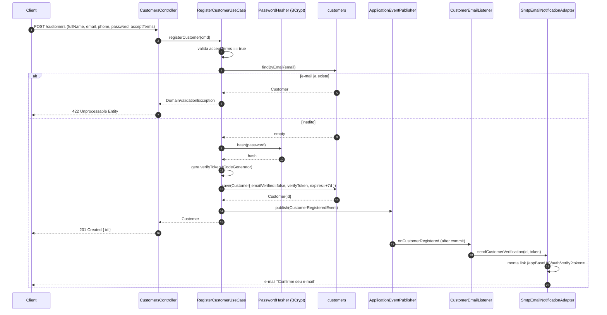

---

### 2.2 `POST /customers/verify-email` — Verificacao de e-mail

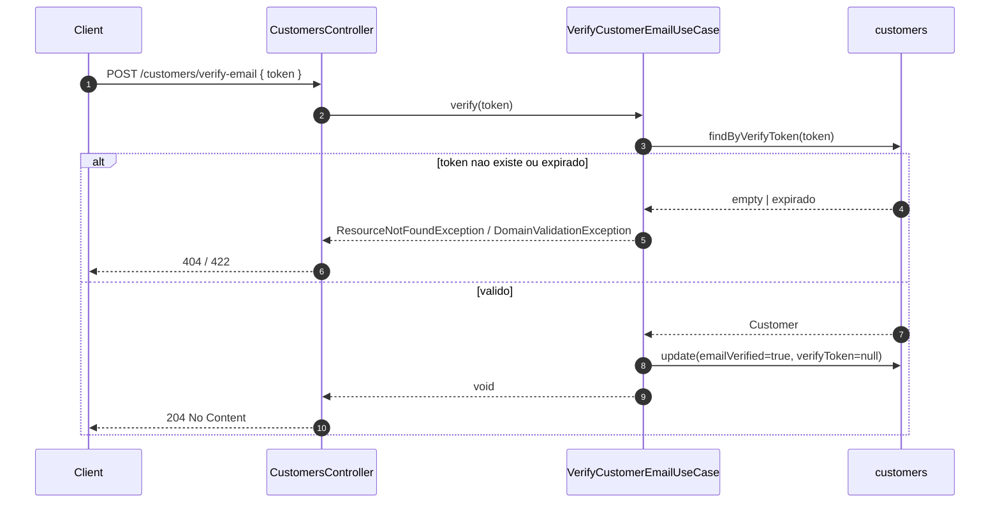

---

### 2.3 `POST /auth/login` — Autenticacao

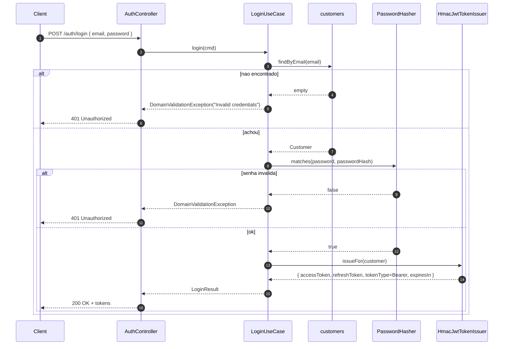

---

### 2.4 `POST /auth/refresh` — Renovar token

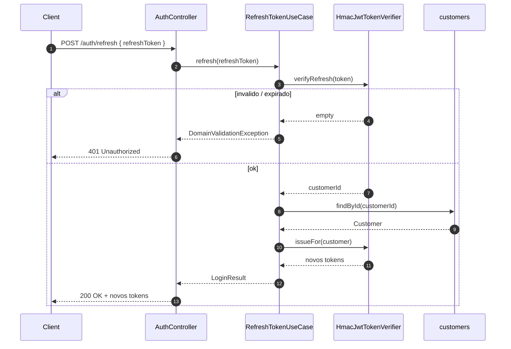

---

### 2.5 `GET /units`, `/categories`, `/services`, `/professionals` — Catalogo

Fluxo identico para os 4 endpoints (so muda o use case). Exemplo com `/units`:

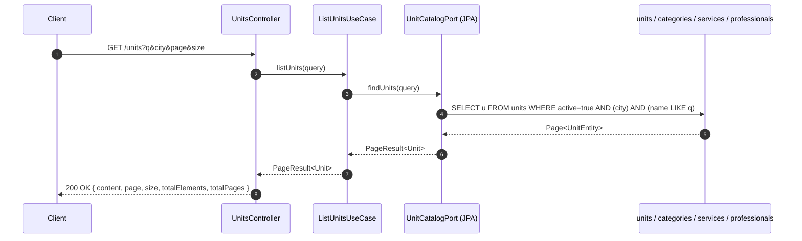

> Os endpoints `GET /units/{id}/categories`, `/services`, `/professionals` seguem o
> mesmo formato — apenas trocam o repositorio chamado (CategoryJpaRepository,
> ServiceJpaRepository, ProfessionalJpaRepository).

---

### 2.6 `GET /availability` — Slots disponiveis

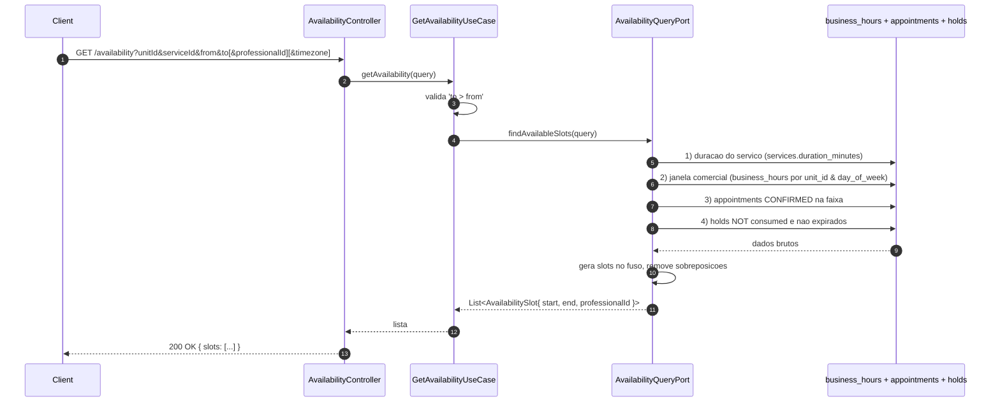

---

### 2.7 `POST /appointments/holds` — Cria pre-reserva

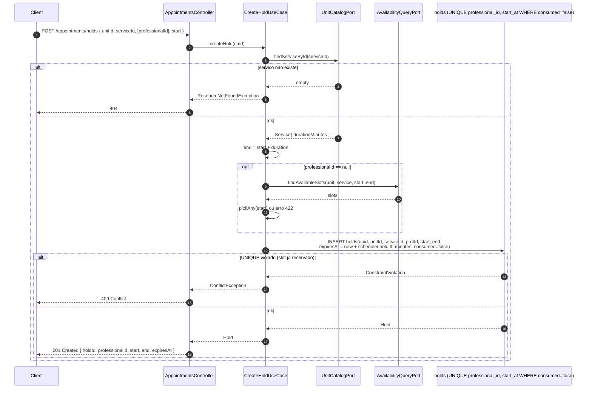

> **TTL do hold**: configurado em `scheduler.hold.ttl-minutes` (default `10`). Um job
> periodico (Hibernate UPDATE) marca holds expirados como `consumed=true`.

---

### 2.8 `DELETE /appointments/holds/{holdId}` — Libera pre-reserva

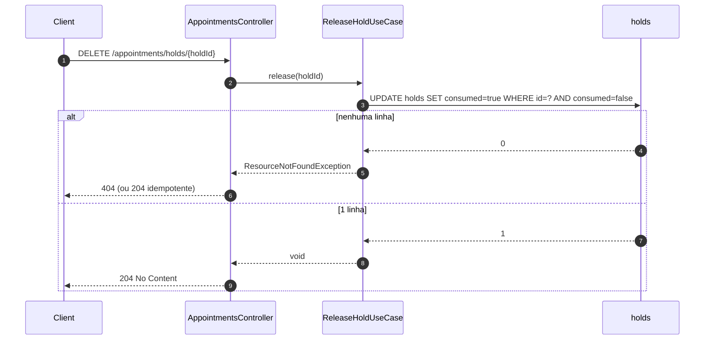

---

### 2.9 `POST /appointments` — Confirma agendamento

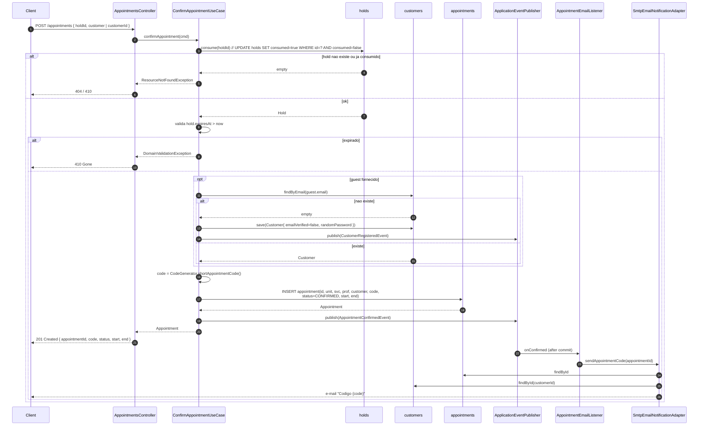

> O header `Idempotency-Key` e aceito mas atualmente nao reaproveita resposta (TODO).

---

### 2.10 `GET /appointments/by-code/{code}` — Consulta publica

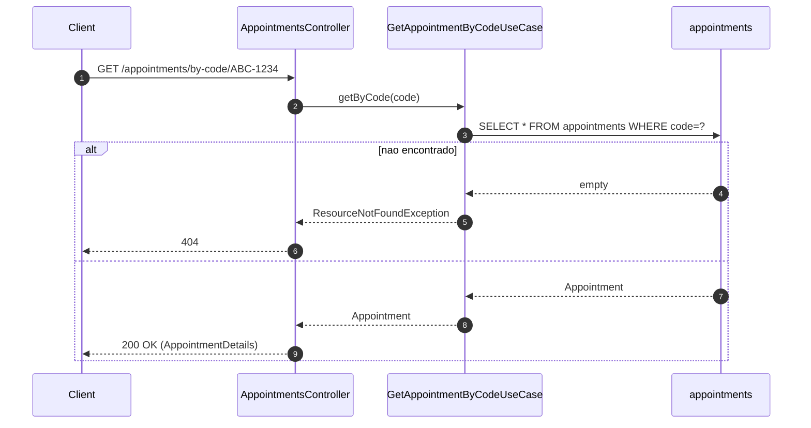

---

### 2.11 `POST /appointments/{id}/resend-code` — Reenvio de e-mail

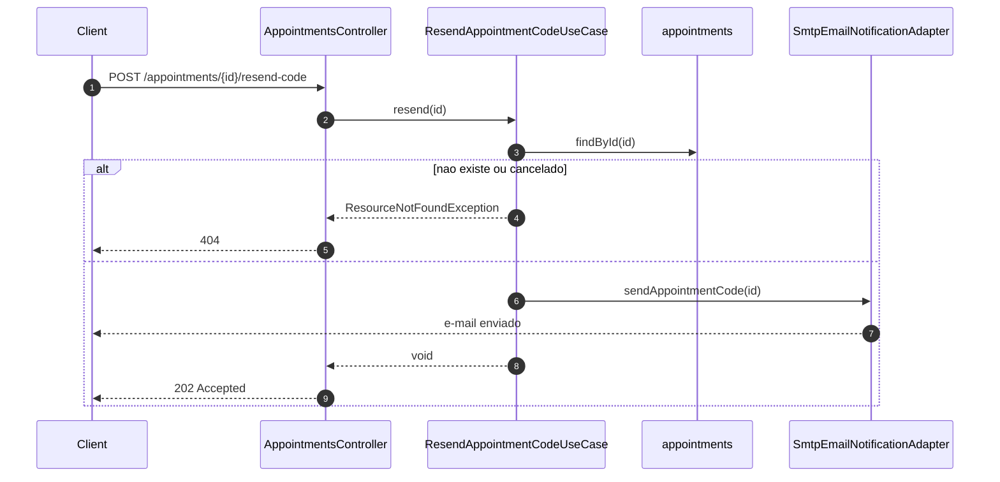

> Rate-limit pode retornar **429 Too Many Requests** (regra externa, ainda nao implementada).

---

### 2.12 `PATCH /appointments/{id}/reschedule` — Remarca

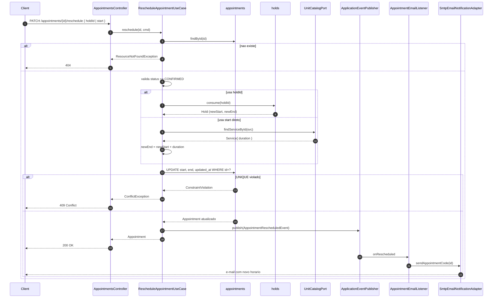

---

### 2.13 `DELETE /appointments/{id}` — Cancela

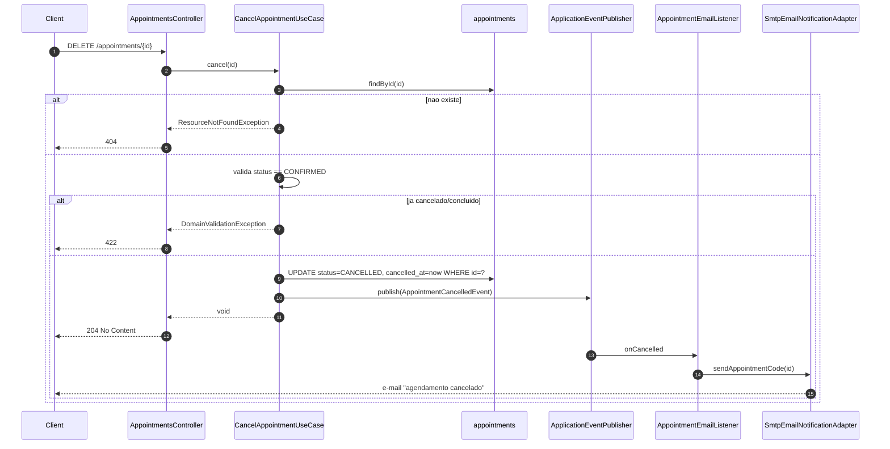

---

### 2.14 `GET /customers/me/appointments` — Meus agendamentos (autenticado)

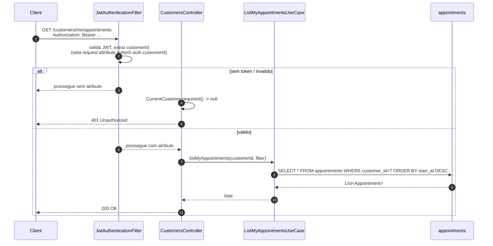

---

## 3. Maquina de estados do `Appointment`

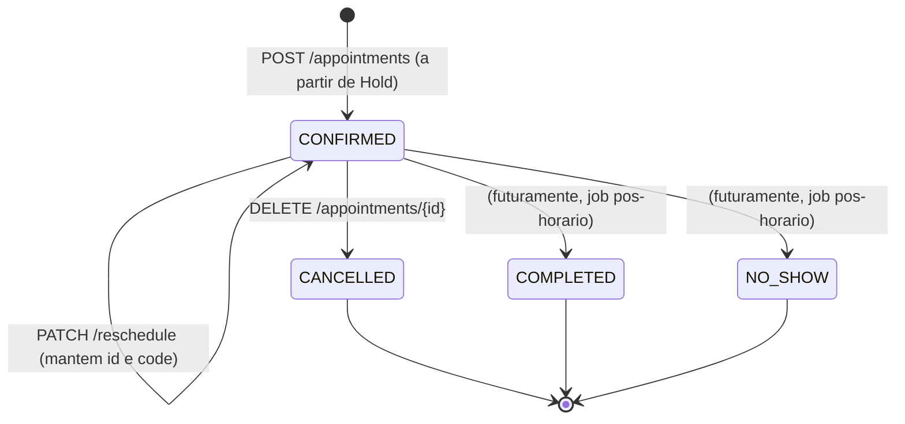

E a do `Hold`:

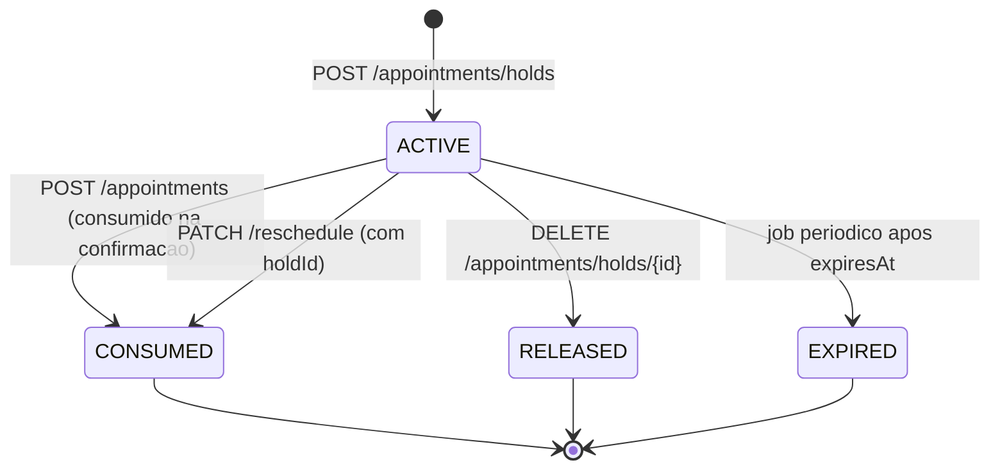

> Tecnicamente todos os estados terminais sao `consumed=true` no banco; o que muda e
> o motivo (linkado ou nao a um appointment / cancelamento explicito / TTL job).

